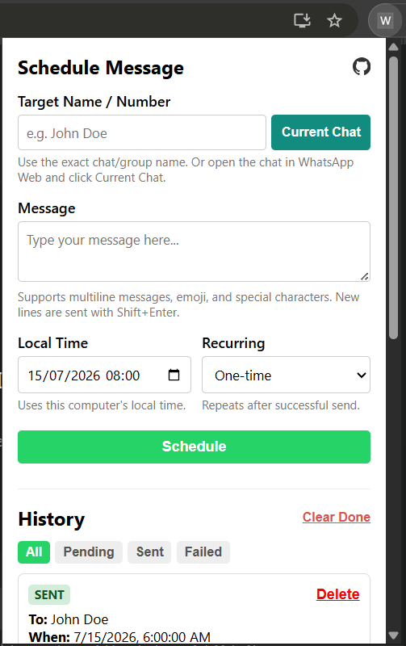

<!--
  WhatsApp Web Scheduler
  Copyright (c) 2026 Fajar BC (https://github.com/fajarbc)
  Licensed under MIT License
-->

# WhatsApp Web Scheduler

A simple Google Chrome Extension to schedule sending text messages on WhatsApp Web automatically at a specified local time. It supports one-time and recurring (daily/weekly/monthly) messages.

> 🔒 **Privacy first:** Your messages and schedules never leave your browser. Everything is stored locally on your machine.

**Copyright (c) 2026 Fajar BC — https://github.com/fajarbc**  
Licensed under the [MIT License](LICENSE).

## Screenshot

## Features
- Wakes up via Chrome Alarms in the background.
- Scans open tabs for an active WhatsApp Web session, or automatically opens a new one if none exists (Fully Automated).
- Uses DOM manipulation to search the contact, type the message, and click send.
- Extract target name directly from an active chat via the "Capture Open Chat" button.

## Architecture
- **Tech Stack**: Vanilla HTML/CSS/JS, Manifest V3. No npm or bundlers required.
- **`background.js`**: Background service worker running the scheduler and handling tabs.
- **`content.js`**: Injected script running on `https://web.whatsapp.com/` communicating with WhatsApp Web's DOM structure.
- **`popup.html/js`**: UI to schedule, view, and delete messages.

## Installation

This extension is not available on the Chrome Web Store yet.

### Download ZIP from GitHub Releases
1. Go to [GitHub Releases](https://github.com/fajarbc/waweb-scheduler/releases).
2. Download `waweb-scheduler.zip` from the latest release.
3. Extract the ZIP file.
4. Open Google Chrome and navigate to `chrome://extensions/`.
5. Enable **Developer mode** using the toggle switch in the top right corner.
6. Click **Load unpacked**.
7. Select the extracted extension folder.
8. Pin the extension to your toolbar for easy access.

### Development Mode
1. Clone this repository.
2. Open Google Chrome and navigate to `chrome://extensions/`.
3. Enable **Developer mode**.
4. Click **Load unpacked**.
5. Select this project folder (`bot-wa`).
6. Pin the extension to your toolbar for easy access.

## Release ZIP Automation

Every push to `main` and every manual GitHub Actions run creates a GitHub Release containing `waweb-scheduler.zip` for direct download.

## Usage Guide
### Capture and Schedule
1. Open [WhatsApp Web](https://web.whatsapp.com/) in a Chrome tab and log in with the QR code.
2. Select the chat (contact or group) you want to send a message to.
3. Click the Extension icon in your Chrome toolbar.
4. Click **Capture Open Chat** to automatically fill in the Target Name.
5. Enter your message.
6. Select a local time to send.
7. Click **Schedule**.

### Full Auto Requirement
When the time comes, the extension will automatically:
1. Look for an open `web.whatsapp.com` tab.
2. If found, it will bring it to focus.
3. If not found, it will open a new tab to WhatsApp Web automatically.
4. Search the target name.
5. Type and send the message.

> **Important**: You must remain logged into WhatsApp Web in your browser (no QR code required). If the automation opens WhatsApp Web and it asks for a QR code, the scheduled job will fail. 

## Limitations & Risks
- **WhatsApp Web DOM changes**: Since WhatsApp Web's layout and code class names change frequently, this extension uses semantic selectors (like `title`, `data-icon`, `contenteditable`). However, major DOM restructures by Meta could break the `content.js` automation logic.
- **React Input Events**: React doesn't recognize programmatic `value` changes in input fields. This extension circumvents this by focusing the input and using `document.execCommand('insertText')` alongside dispatching native input events.

## Development Tasks Complete
- [x] Extension Manifest setup (`manifest.json`)
- [x] Background worker scheduling engine and Auto-Tab discovery
- [x] Popup User Interface for schedule management
- [x] Content script with DOM interaction (`content.js`)
- [x] Documentation and setup steps
